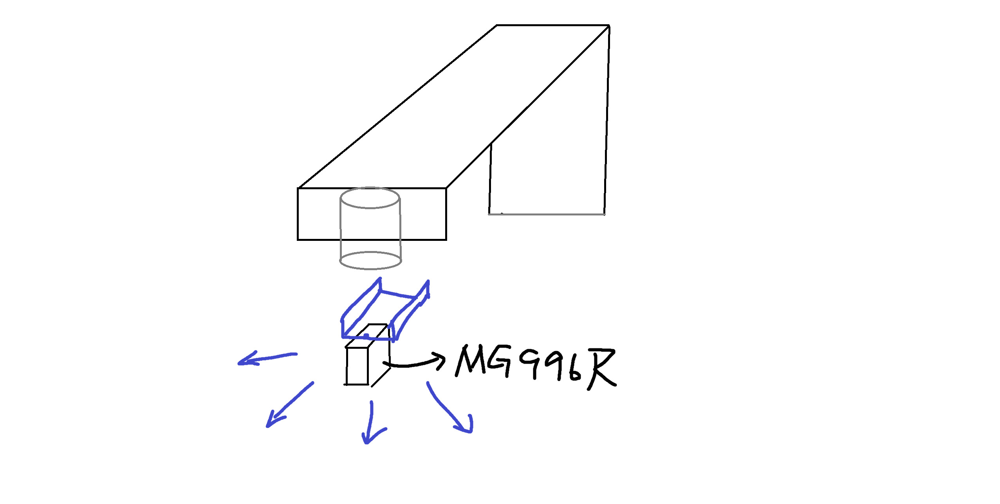
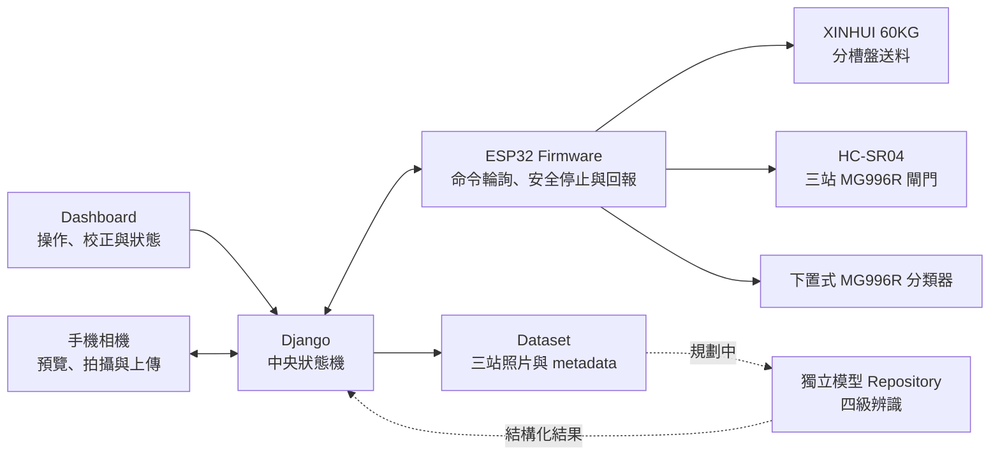

# 百香果 IoT 三站影像採集與分類系統

本專案整合 ESP32、Django、手機相機與伺服機構，建立百香果單顆送料、三站固定角度拍攝、Dataset 管理與四級實體分流。現行軟體已能協調送料、三站拍攝、人工分類與資料生命週期；2026-08-22 已接受新的平台、送料、分類器與供電架構，但機構、複合分類流程及完整實機驗收尚未完成。



## 專案目標與目標流程

百香果的外形、大小與蒂頭方向差異明顯，滾動拍攝容易產生模糊、角度不一致或漏拍。本系統讓果實停在三個固定站點，只有照片成功保存且下一段硬體安全條件成立時才繼續移動。

目標流程如下：

1. XINHUI `60KG` 連續旋轉伺服帶動分槽送料盤，送出一顆百香果。
2. HC-SR04 確認果實抵達，ESP32 在本機停止送料馬達。
3. 三顆位置型 MG996R 閘門讓果實依序停在三個拍攝站點，手機依 Django 指示拍攝並上傳照片。
4. 第 3 張照片保存後，Gate 3 保持關閉，果實留在第 3 站等待分類。
5. 操作員完成人工分級；未來 AI 只提供結構化判斷，並保留人工覆核。
6. `classify_fruit` 先讓平台下方的 MG996R 分類器對準目標出口，再慢速放行 Gate 3。
7. 分類器保持目標角度 `1000 ms`，等待果實通過落料管，再與 Gate 3 安全歸位。
8. 完整分類動作成功後，Django 才允許送入下一顆果實。

> [!NOTE]
> 上述為 [ADR-0016](docs/adr/0016-hardware-platform-feeder-sorter-redesign.md) 接受的目標架構。現行 Django 與 Firmware 仍保留第 3 張照片後的獨立 Gate 3 放行流程，實作差異與驗收狀態以 [目前狀態](docs/CURRENT_STATUS.md) 為準。

## 系統架構



Django 是 capture、送料與分類狀態的唯一來源。ESP32 以 HTTPS client 輪詢命令，在本機負責感測、馬達停止與有界硬體流程；手機只處理相機 readiness、單站拍攝與上傳。模型訓練與推論位於獨立 Repository，不由本 Repository 追蹤權重或訓練輸出。

硬體使用兩組彼此獨立的 `AC 110 V → DC 12 V／20 A` 電源。電源 A 經 LM25116 降至 `6.0 V`，供三站與分類器共四顆 MG996R；電源 B 經另一顆 LM25116 降至 `8.4 V`，只供 XINHUI 送料馬達。完整接線與市電安全要求見 [硬體接線與驗收摘要](hardware_notes/硬體接線與驗收摘要.md)。

## 我的主要負責項目

- 設計 ESP32 Firmware，整合 HC-SR04、送料、三站閘門與分類器。
- 建立 Django 與 ESP32 的 API、command ID、狀態機、互斥與 retry 流程。
- 整合手機相機頁、Dashboard、三站拍攝與 Dataset 生命週期。
- 設計並迭代拍攝平台、一體式送料筒、分槽送料盤與下置式分類器。
- 規劃雙電源、降壓、共地、感測器電平保護與實機驗收方式。
- 維護系統規格、架構決策、硬體紀錄與安全稽核文件。

## 目前進度

最新進度與數值以 [目前狀態](docs/CURRENT_STATUS.md) 為準；未完成工作的詳細規格與討論由 [GitHub Issues](https://github.com/Eten0721/PassionFruit_IoT_hardware/issues) 追蹤。

### 已完成

- Django 中央狀態機可協調 HC-SR04、手機單站拍攝與 ESP32 三站閘門。
- 每顆果實可保存三張站點照片，照片原子保存成功後才推進流程。
- Dashboard 可管理拍攝 timing、送料校正、照片檢查、人工分類與刪除。
- Capture、送料與 sorter 共用單一 motor command slot，command ID 與 retry 具備冪等保護。
- HC-SR04 正式送料與測試送料共用回授停止、最大運轉時間與感測器 unavailable 安全停止。
- 正式 Firmware 已依感測、閘門、分類器、HTTPS 與流程控制拆分模組。

### 已決定，待實作與驗收

- 重建低點 `7 cm`、高點 `18 cm`、水平長度 `55 cm`、寬度 `21 cm`、軌道內寬 `10 cm` 的拍攝平台，三站間距為 `16 cm`。
- 三站閘門升級為位置型 MG996R，Firmware 以非阻塞的小角度遞增模擬慢速轉動。
- 上游改用 XINHUI `60KG` 連續旋轉伺服與分槽送料盤，保留 HC-SR04 本機停止契約。
- 分類器移到平台出口正下方，只保留一顆位置型 MG996R，以落料管與帶坡度的ㄇ型鐵導向四個籃子。
- 實作 Gate 3 等待分類及複合 `classify_fruit`，並驗證斷電、重新啟動與不確定結果時不自動重放。
- 驗證兩組電源、LM25116、`20 AWG` 線材、端子、壓降與溫升，再完成混合果形的連續 `20` 顆流程。
- 建立 Dataset 第二份備份、正式 train／valid／test 切分、標註與模型驗收；AI 尚未接入正式流程。

## 技術組成

| 類別 | 技術與裝置 |
|---|---|
| Backend | Python `3.14.4`、Django `5.2.16` LTS、REST API |
| Frontend | HTML、CSS、JavaScript、WebRTC |
| Firmware | ESP32、Arduino C++、ESP32Servo `3.2.1` |
| Target hardware | HC-SR04、XINHUI `60KG`、4 顆位置型 MG996R、雙 `12 V／20 A` 電源、LM25116 |
| Data | JPEG、CSV metadata、檔案系統 Dataset |
| Engineering | Git、GitHub Issues、ADR、模組化狀態機與實機驗收 |

## Repository 結構

```text
PassionFruit_IoT_hardware/
├── Django_Server/      # Dashboard、手機相機、API、狀態機與 Dataset 管理
├── firmware/           # 正式 ESP32 Firmware 與硬體測試程式
├── docs/               # 架構、規格、現況、ADR、部署與硬體紀錄
├── hardware_notes/     # 接線安全、驗收摘要與機構參考圖
└── external/           # 被忽略的獨立模型 Repository checkout
```

模型訓練、推論與 Decision Dataset 契約由獨立的 [ps-quality-detection-system](https://github.com/fcu-passionfruit-project/ps-quality-detection-system) Repository 維護；Dataset、原始照片、模型權重與訓練輸出不納入本 Repository。

## 文件導覽

- [環境部署說明](docs/環境部署說明文件.md)
- [專案脈絡與架構](docs/PROJECT_CONTEXT.md)
- [目前狀態](docs/CURRENT_STATUS.md)
- [送料、三站資料採集與分類規格](docs/DATA_COLLECTION_SPEC.md)
- [送料、三閘門與分類器硬體開發紀錄](docs/HARDWARE_DEVELOPMENT_REPORT.md)
- [硬體接線與驗收摘要](hardware_notes/硬體接線與驗收摘要.md)
- [ADR-0016：硬體平台、送料與分類器重構](docs/adr/0016-hardware-platform-feeder-sorter-redesign.md)
- [架構決策索引](docs/adr/README.md)
- [Django／ESP32 安全與品質稽核](docs/SECURITY_AUDIT_2026-07-11.md)

> [!CAUTION]
> 現行安全模型只適用可信任且隔離的實驗室區網。將系統部署至公開網路前，必須完成 TLS 憑證驗證、API authentication、production settings 與其他安全稽核項目。
