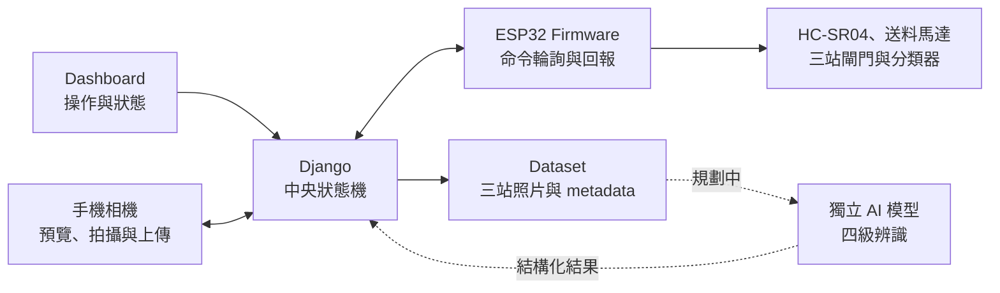

# 百香果 IoT 三站影像採集與分類系統

本專案整合 ESP32、Django、手機相機與伺服機構，建立百香果單顆送料、三站固定角度拍攝、Dataset 管理與實體分級流程。現階段重點是穩定取得每顆果實的三張清晰照片，並由人工完成四級分類；AI 推論會在 Dataset 與模型通過驗收後接入既有流程。


## 專案目標

百香果外形、大小與蒂頭方向差異明顯，滾動拍攝容易出現模糊、角度不一致或漏拍。本系統讓果實依序停在三個固定站點，確認照片保存成功後才放行下一個閘門，建立可追蹤、可重拍且適合後續模型訓練的影像資料。

預期完整流程為：

1. 上游送料筒送出一顆百香果。
2. HC-SR04 確認果實抵達並停止送料馬達。
3. 三組閘門讓果實依序停在固定站點。
4. 手機依 Django 指示拍攝並上傳每站照片。
5. Django 原子保存三張照片，管理 Dataset 與分類狀態。
6. 現階段由操作員人工分級；未來由 AI 提供結構化判斷並保留人工覆核。
7. 位置型 MG996R 將果實導向上等、中等、下等或加工出口。

## 系統架構



Django 是 capture、送料與分類狀態的唯一來源。ESP32 以 HTTPS client 輪詢命令，在本機負責硬體安全停止；手機只處理相機 readiness、單站拍攝與上傳。模型訓練與推論位於獨立 Repository，不由本 Repository 追蹤權重或訓練輸出。

## 我的主要負責項目

- 設計 ESP32 Firmware，整合 HC-SR04、三組 SG90 閘門、送料 MG996R 與分類 MG996R。
- 建立 Django 與 ESP32 的 API、command ID、狀態機、互斥與 retry 流程。
- 整合手機相機頁、Dashboard、三站拍攝與 Dataset 生命週期。
- 設計並迭代三閘門、上游送料筒、徑向撥片與分類機構。
- 規劃區網部署、外部供電、共地、感測器降壓與實機驗收方式。
- 維護系統規格、架構決策、硬體紀錄與安全稽核文件。

## 目前進度

最新進度與數值以 [目前狀態](docs/CURRENT_STATUS.md) 為準；未完成工作的詳細規格與討論由 [GitHub Issues](https://github.com/Eten0721/PassionFruit_IoT_hardware/issues) 追蹤。

### 已完成

- Django 中央狀態機可協調 HC-SR04、手機單站拍攝與 ESP32 三站閘門。
- 每顆果實保存三張站點照片，照片原子保存成功後才放行下一閘門。
- Dashboard 可管理拍攝 timing、檢查照片、人工分類、刪除與送料校正。
- Capture、送料與 sorter 共用單一 motor command slot，command ID 與 retry 具備冪等保護。
- 人工分類會先提交 Dataset 與 metadata，再驅動位置型 MG996R；硬體失敗不回滾資料。
- HC-SR04 正式送料與測試送料共用回授停止、最大運轉時間與感測器 unavailable 安全停止。
- 正式 Firmware 已依感測、閘門、分類器、HTTPS 與流程控制拆分模組。

### 開發中

- [Issue #1](https://github.com/Eten0721/PassionFruit_IoT_hardware/issues/1)：安裝並校正一體式送料筒、360° MG996R 與四片徑向撥片。
- [Issue #2](https://github.com/Eten0721/PassionFruit_IoT_hardware/issues/2)：加入分類器 SG90 擋臂與分類後出料機構。
- 正式自動運轉已開放 runtime 安全檢查與優雅暫停；Issue #1 仍追蹤送料機構校正與連續運轉實機驗收。

### 待實機驗證

- 使用同一批 `10` 顆果實完成送料校正、空筒逾時與不同剩餘量測試。
- 使用混合果形連續完成 `20` 顆送料、三站拍攝與實體分類。
- 驗證 Wi-Fi／TLS timeout、手機未上傳、重複 command 與 Django／ESP32 重新啟動。
- 以三組獨立 `4 × AA` 電池盒進行待量測驗證，記錄動作中最低電壓、溫升、送料未起轉次數與 ESP32 reset。
- 建立 Dataset 第二份備份、正式 train／valid／test 切分、標註與模型驗收。
- 串接正式 AI 推論、信心門檻、人工覆核與版本管理；目前仍由人工分類。

## 技術組成

| 類別 | 技術與裝置 |
|---|---|
| Backend | Python `3.14.4`、Django `5.2` LTS、REST API |
| Frontend | HTML、CSS、JavaScript、WebRTC |
| Firmware | ESP32、Arduino C++、ESP32Servo |
| Hardware | HC-SR04、SG90、360° MG996R、位置型 MG996R |
| Data | JPEG、CSV metadata、檔案系統 Dataset |
| Engineering | Git、GitHub Issues、ADR、模組化狀態機與實機驗收 |

## Repository 結構

```text
PassionFruit_IoT_hardware/
├── Django_Server/      # Dashboard、手機相機、API、狀態機與 Dataset 管理
├── firmware/           # 正式 ESP32 Firmware 與硬體測試程式
├── decision_layer/     # 未來 AI 決策層的輸入與輸出契約
├── docs/               # 架構、規格、現況、ADR、部署與硬體紀錄
└── hardware_notes/     # 接線安全、驗收摘要與機構參考圖
```

模型訓練與推論由獨立的 `ps-quality-detection-system` Repository 維護；Dataset、原始照片、模型權重與訓練輸出不納入本 Repository。

## 文件導覽

- [環境部署說明](docs/環境部署說明文件.md)
- [專案脈絡與架構](docs/PROJECT_CONTEXT.md)
- [目前狀態](docs/CURRENT_STATUS.md)
- [送料、三站資料採集與分類規格](docs/DATA_COLLECTION_SPEC.md)
- [送料、三閘門與分類器硬體開發紀錄](docs/HARDWARE_DEVELOPMENT_REPORT.md)
- [硬體接線與驗收摘要](hardware_notes/硬體接線與驗收摘要.md)
- [架構決策索引](docs/adr/README.md)
- [Django／ESP32 安全與品質稽核](docs/SECURITY_AUDIT_2026-07-11.md)

> [!CAUTION]
> 現行安全模型只適用可信任且隔離的實驗室區網。將系統部署至公開網路前，必須完成 TLS 憑證驗證、API authentication、production settings 與其他安全稽核項目。
