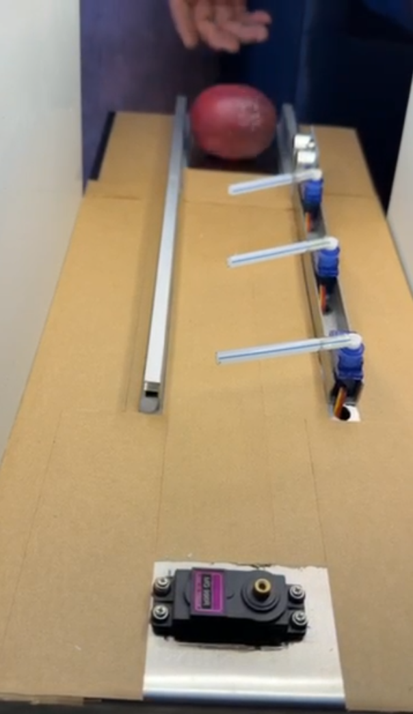
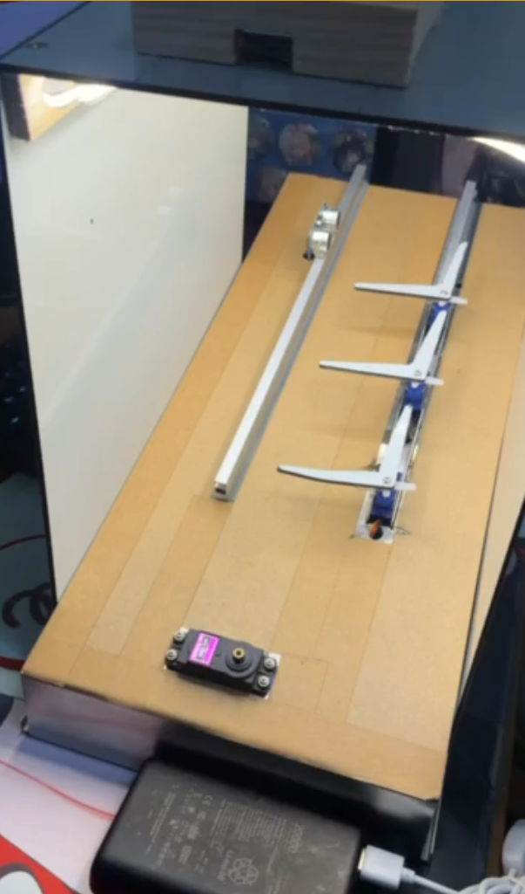

# 送料、三閘門與分類器硬體開發紀錄

更新日期：2026-07-27

## 紀錄目的

本文件只保存送料與拍攝軌道的機構演進、實測觀察與維修資訊。GPIO、角度、timing、command 與分類 code 統一參考 [DATA_COLLECTION_SPEC.md](DATA_COLLECTION_SPEC.md)。

## 平台基準

目前平台斜面總長約 `47 cm`，短邊高約 `5 cm`、長邊高約 `18 cm`，整體傾斜角約 `16°`。這些是現有機構的實測基準；更換平台或支架後應重新量測，不可直接沿用。

## 初期單桿閘門

初期三個閘門都使用單根直桿。它能攔住一般姿態的果實，但放行時只有單一接觸點，實測出現：

- 果實停在兩站之間。
- 不規則外形只被推偏，沒有持續向前。
- 蒂頭與軌道或桿件干涉。

## 改良為 L 型閘門

後續改為 L 型結構，旋轉時由後方桿件持續接觸並推動果實，降低停在站點之間的機率。L 型桿仍須配合軌道寬度與接觸高度校正，避免推力位置過高或刮到底板。

## 相鄰閘門高度錯位

三組 L 型桿的旋轉範圍較大，相同安裝高度會使相鄰桿件碰撞。中間馬達目前墊高約一個桿件厚度，讓旋轉路徑錯開。維修後必須完整轉動三組閘門，確認沒有干涉或固定件鬆動。

## 馬達安裝高度

初期馬達過高，桿件容易從果實上方掠過或只使果實傾斜。降低整排馬達後，接觸點更接近有效受力位置。調整時同時確認歸位能攔截、放行能推動，且桿件不刮軌道。

目前卡果主要發生在第 2 閘門前往第 3 閘門的路段，拍攝與分類功能仍可正常運作。下一次機構調整將降低三個閘門高度並延長閘門桿，目標是讓接觸點更穩定地推動不同尺寸、外形與蒂頭方向的果實；調整後必須重新執行三站停穩與桿件干涉驗收。

## HC-SR04 位置

感測器原先位於軌道右側，接近閘門旋轉路徑；後續移到左側以避開撞擊。移位後需重新檢查感測方向、固定件反射與觸發穩定性。電壓安全與分壓量測見 [`hardware_notes/硬體接線與驗收摘要.md`](../hardware_notes/硬體接線與驗收摘要.md)。

## 上游單顆送料機構

送料機構使用連續旋轉 SG90 推動送料桿。每次送料步進只驅動一段校正時間，目標約旋轉 `90°`，之後立即停止；果實離開料斗後依重力自然滾向 HC-SR04。送料桿不得在一次步進後繼續旋轉，否則可能推下多顆果實。

此方案不使用 Home 感測器或步進馬達，方向固定為順時針。方向基準是面向輸出軸／servo horn、視線朝向馬達本體。TowerPro 標示此型號無負載速度為 [4.8 V 時 `110 RPM`、6 V 時 `130 RPM`](https://towerpro.com.tw/product/sg90-360-degree-continuous-rotation-servo/)，理想 `90°` 約為 `115～136 ms`；負載、電壓、摩擦與安裝公差都會改變實際結果，正式值只能由空料斗校正與帶果實驗收決定。

空料斗校正順序：

1. 在輸出軸或送料桿做可見記號。
2. 調整停止脈波，確認馬達停止時沒有爬行。
3. 執行「測試送料一次」，確認方向為順時針；方向錯誤時改用停止值另一側的驅動脈波。
4. 微調運轉時間，使單次約為 `90°`，且每次到期都停止。
5. 在 Dashboard 確認送料校正後，才進入帶果實測試。

開迴路控制無法保證精確角度，也可能累積位置偏移。若混合果形的連續 `20` 顆測試無法消除漏送、雙送、停不住或必須人工重對送料桿，先調整送料桿、料斗出口與機構容差；仍無法通過時再重新評估位置回授或致動器，禁止以自動補轉清除失敗。

## MG996R 分類機構

MG996R 位於三站流程之後，依人工分類結果轉向實體出口。它不參與前三站拍攝或 Gate 3 交握，且沒有位置回授。供電、共地與機械驗收見 [`hardware_notes/硬體接線與驗收摘要.md`](../hardware_notes/硬體接線與驗收摘要.md)。

實測需確認：

- 四個出口與 Home 都不碰硬限位。
- 外部電源壓降、溫升與 ESP32 是否重啟。
- 重複 command 或 report retry 不會再次轉動。
- 分類器錯誤復原不會驅動三站閘門。

## 維修與實機觀察

每次拆裝後檢查：

1. 不同尺寸、形狀與蒂頭方向的果實能否依序攔截與放行。
2. 相鄰 L 型桿完整旋轉時是否碰撞。
3. 第 2、3 站 ready 前果實是否已停止。
4. 感測器是否避開桿件，移位後是否仍穩定。
5. 馬達墊高件、ㄇ型鐵、連桿與底板是否鬆動。
6. 外部電源、共地與線材是否發熱或接觸不良。
7. 送料馬達停止時是否爬行，單次送料後桿件是否累積偏移。

送料機構由 GitHub Issue [#1](https://github.com/Eten0721/PassionFruit_IoT_hardware/issues/1) 開發；分類後出料閘門由 Issue [#2](https://github.com/Eten0721/PassionFruit_IoT_hardware/issues/2) 追蹤。
