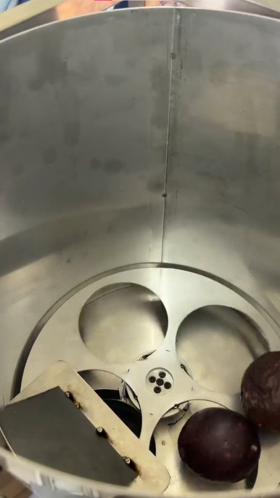
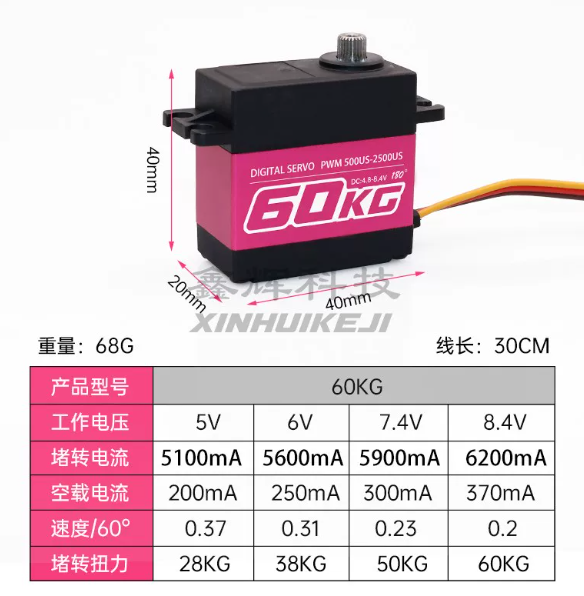
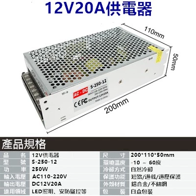
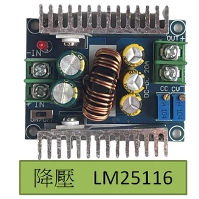

# ADR-0016：拍攝平台、送料與分類器硬體重構

- Status: Accepted
- Date: 2026-08-22

## Context

三站拍攝平台使用 SG90 時負載餘裕不足，閘門快速轉動也容易推擠或卡住果實；電池盒供電曾出現送料馬達未起轉，且缺少動作中電壓與電流餘裕。舊分類器位於拍攝斜面末端，另加 SG90 擋臂會增加機構與控制複雜度。上游四片徑向撥片也難以穩定分隔果實，因此需要同時重構平台、送料、分類與供電。

## Decision

### 拍攝平台與三站閘門

拍攝平台重建為低點高 `7 cm`、高點高 `18 cm`、水平投影長度 `55 cm`、平台寬度 `21 cm`、軌道內寬 `10 cm`，三站中心間距採 `16 cm`。依高低差 `11 cm` 與水平投影推算，斜面長度約為 `56.1 cm`、坡度約為 `11.3°`；這兩個值是幾何推算，完工後仍須實測。

三站閘門全部改用位置型 MG996R，沿用 GPIO `18`、`19`、`21` 與 Home／Release 邏輯。新平台先使用直接寫入 Home／Release 角度的現行控制方式；是否需要非阻塞小角度遞增，須依新平台實機觀察決定，並由 GitHub Issue [#16](https://github.com/Eten0721/PassionFruit_IoT_hardware/issues/16) 獨立追蹤，不阻擋 Gate 3／分類器複合流程。

### 下置式分類器與 Gate 3 交握

分類器只保留 GPIO `25` 的位置型 MG996R，不增加 SG90 擋臂。分類器移到拍攝平台出口正下方；平台出口接名目直徑 `10 cm` 的落料管，MG996R 圓形舵盤固定帶輕微坡度的ㄇ型鐵，依四級分類角度把果實導向對應籃子。落料管實際內徑必須能通過最大樣本果實。

第 3 張照片保存後，果實停留在 Gate 3，Django 不再建立 `station_index=3` 的獨立 `release_gate`。此時 Gate 1 與 Gate 2 維持 Release，Gate 3 維持 Home。人工按鈕繼續作為目前的四級分類入口，未來 AI 只能取代分類結果來源並進入相同邊界；wire payload 繼續使用 `command_id` 與 `classification_code`，不傳送 GPIO、角度或 timing。

1. 分類器移至目標角度。
2. 以開迴路方式等待分類器就位 `500 ms`，再將 Gate 3 直接放行至 Release。
3. 從 Gate 3 到達 Release 後計時，分類器維持目標角度 `1000 ms`，等待果實通過落料管並滾向籃子。
4. 三顆 Gate 同時回到 Home `0°`，分類器同時回到 Home `85°`。
5. 等待共同歸位 `500 ms` 後，才回報 `classification_sorter_completed`。

位置型 MG996R 沒有位置回授，`500 ms` 只表示分類器就位等待完成，不證明實際到達目標角度。Firmware 必須回報 `gate3_sorter_v1` capability；Django 未收到此能力時，在 Dataset 提交前拒絕分類並保留暫存照片與 Gate 3 上的果實。分類器動作無法開始或結果不確定時，Gate 3 必須保持關閉。斷電、重新啟動或結果不確定時不得自動重放實體動作，必須停止自動運轉並要求操作員檢查。刪除未分類果實時也不自動開啟 Gate 3，由操作員斷電確認安全後移除果實。

### 上游送料

上游保留頂部開放的一體式送料筒、側面出口、GPIO `23`、HC-SR04 正常停止、安全逾時與不自動補轉契約。筒底中央的四片徑向撥片改成扭蛋機式分槽盤，送料馬達改用 XINHUI `60KG` 連續旋轉版本。槽數、槽寬、盤片間隙、出口幾何與單顆分離能力須依成品實測，不在本 ADR 固定數值。

### 雙電源供電

取消所有馬達電池盒，改用兩組彼此獨立的 `AC 110 V → DC 12 V／20 A` 電源：

- 電源 A 經一顆 LM25116 模組初始降至 `6.0 V`，供三站閘門與分類器共四顆 MG996R；輸出不得超過原廠 `6.6 V` 額定上限。
- 電源 B 經另一顆 LM25116 模組降至 `8.4 V`，只供 XINHUI `60KG` 送料馬達。
- 兩路正極不得互接；兩路 DC 負極、ESP32 GND 與全部伺服訊號地必須共地。
- 市電端必須具有保護接地、適當保險絲、端子遮罩與可辨識的斷電裝置；配線及維修只能在市電與 DC 輸出都已斷電後執行。

負載估算將額定、設計預留與實測分開記錄。四顆 MG996R 以保守配電值 `2.5 A／顆` 計算，`6.0 V` 電源軌為 `10 A／60 W`；XINHUI 依購買頁面的 `8.4 V／6.2 A` 計算為 `52.08 W`。不同電壓電源軌的電流不得直接相加，伺服端估算功率可合計為 `112.08 W`。單顆 `12 V／20 A` 電源的電壓電流乘積為 `240 W`；賣場 `250 W` 只視為商品標示。

Tower Pro 對 [MG996R](https://towerpro.com.tw/product/mg996R/) 標示 `4.8～6.6 V`，因此不採用 `7.2 V` 供電。Texas Instruments 的 [LM25116](https://www.ti.com/product/LM25116) 是同步降壓控制器；購買模組能否長時間承受賣場宣稱的 `20 A／300 W`，仍取決於外接元件、散熱與實測。已購買的 `20 AWG` 線材也不能直接視為可承載共用主幹電流，須依實際長度、分支電流、端子能力、壓降與溫升驗收。

## Consequences

本 ADR 取代 [ADR-0015](0015-integrated-radial-paddle-feeder.md) 的四片徑向撥片、MG996R 送料馬達及電池盒假設；一體式送料筒與側面出口繼續保留，但尺寸及分槽盤細節須重新驗收。[ADR-0014](0014-hcsr04-terminated-upstream-feed.md) 的 HC-SR04 本機停止、安全逾時、command 冪等與不自動補轉決策維持有效。

本決策先建立目標硬體與流程契約。Django 與 Firmware 尚未實作 Gate 3 等待分類、複合 `classify_fruit`、`gate3_sorter_v1` capability 及 XINHUI 送料校正；三站慢速角度遞增只在 Issue #16 的實機觀察證明仍會夾果後才進入開發。正式自動運轉必須等文件中的電氣、機構與完整流程驗收通過後才可恢復。
